# TrustXCloud: Explainable and Trustworthy AI for Cloud Security Decisions

**Comprehensive System Architecture, Data Flow, and Feature Implementation Guide**

---

## 1. Executive Project Overview

**TrustXCloud** is an advanced, production-grade cloud security system designed to detect and explain AWS Identity and Access Management (IAM) threats in real time. Rather than relying on black-box predictions or naive heuristic alert rules, TrustXCloud combines:

1. **Dual Machine Learning Classifiers (V3)**: Dual model inference utilizing **XGBoost V3** (Gradient Boosted Decision Trees) and **PyTorch TabNet V3** (Sequential Attention Neural Network) for high-precision, low-latency threat detection.
2. **Multi-Level Explainable AI (XAI)**: Mathematical feature attribution via **SHAP TreeExplainer** (exact Shapley values) paired with **LIME Tabular Explainer** (local linear surrogate model).
3. **Audited Generative LLM Narration**: Natural-language plain-English threat narration and targeted remediation guidance generated by **Google Gemini** (with deterministic offline fallback), rigorously verified against model attributions via an automated **Faithfulness Audit**.
4. **Leakage-Free Dynamic Behavioral Profiling**: An identity baseline cache (`IdentityBaselineCache`) that calculates principal-specific behavioral deviations (new IP, new region, 10-minute rolling frequency) using strictly historical temporal windows $[T - 10\text{min}, T)$ and explicit cold-start markers (`-1`).
5. **Dual-Mode Enterprise Ingestion Pipeline**: Real-time streaming infrastructure capable of operating in **Real AWS Mode** (S3 $\to$ EventBridge $\to$ SQS $\to$ Worker $\to$ DynamoDB) and **Local Simulation Mode** for offline evaluation and testing.
6. **Full-Stack SOC Web Application**: Modern Next.js (TypeScript) Security Operations Center (SOC) dashboard integrated with a high-performance FastAPI Python backend, complete with JWT & Google OAuth2 authentication.

---

## 2. End-to-End System Architecture

```mermaid
flowchart TD
    subgraph Ingestion["1. AWS Ingestion & Transport Layer"]
        CT["AWS CloudTrail Multi-Region Logs<br/>(.json.gz / Real-time API)"] --> S3["Amazon S3 Log Bucket"]
        S3 -->|"s3:ObjectCreated"| EB["Amazon EventBridge"]
        EB --> SQS["Amazon SQS Event Queue<br/>(or Local Memory Queue)"]
    end

    subgraph BackendWorker["2. Pipeline Worker & Processing"]
        SQS --> PW["Pipeline Worker / SQS Worker<br/>(backend/infrastructure/pipeline_worker.py)"]
        PW -->|"Raw Event JSON"| CSA["CloudSecurityAnalyzer Engine<br/>(src/predict_and_explain.py)"]
    end

    subgraph FeatureEngineering["3. Feature Engineering & Behavioral Baseline"]
        CSA --> IBC["IdentityBaselineCache<br/>(src/identity_baseline.py)<br/>• Dynamic IP/Region History<br/>• 10m Rolling Window<br/>• Cold Start (-1)"]
        IBC --> FP["CloudTrailFeaturePipeline<br/>(src/feature_pipeline.py)<br/>• 14 Engineered Features<br/>• Categorical Encoders"]
    end

    subgraph DualMLInference["4. Dual ML Inference Engine (V3)"]
        FP -->|"14-dim Feature Vector"| XGB["XGBoost V3 Classifier<br/>(Gradient Boosted Trees)"]
        FP -->|"14-dim Feature Vector"| TAB["PyTorch TabNet V3<br/>(Attentive Neural Net)"]
        XGB & TAB --> DEC["Ensemble Decision & Confidence<br/>• THREAT / BENIGN<br/>• Model Agreement Check"]
    end

    subgraph Explainability["5. Multi-Level XAI & Narration"]
        DEC --> SHAP_EXP["SHAP TreeExplainer<br/>(Top-6 Feature Attributions)"]
        DEC --> LIME_EXP["LIME Surrogate Explainer<br/>(Local Decision Rules)"]
        SHAP_EXP & LIME_EXP --> LLM["LLM Security Narrator<br/>(Google Gemini API / Fallback)"]
        LLM --> AUDIT["Programmatic Faithfulness Audit<br/>(SHAP-to-LLM Alignment Check)"]
    end

    subgraph Storage["6. Persistence & State"]
        AUDIT --> DDB[("AWS DynamoDB Table<br/>CloudSecurityDecisions<br/>(or SQLite / Memory Mock)")]
        AUDIT --> LIVE_STORE["LiveEventsStore<br/>(In-Memory Ring Buffer)"]
    end

    subgraph API["7. FastAPI Backend Services (Port 8000)"]
        DDB & LIVE_STORE --> API_ROUTER["FastAPI Application (backend/main.py)<br/>• Auth & JWT Guard<br/>• Events & Alerts API<br/>• Explainability & XAI API<br/>• Metrics & Trustworthiness API"]
    end

    subgraph Frontend["8. SOC Dashboard (Next.js - Port 3000)"]
        API_ROUTER --> SOC_UI["Next.js SOC Interface<br/>• Executive Dashboard (/dashboard)<br/>• Incident Alerts (/alerts)<br/>• Live Streaming Pipeline (/pipeline)<br/>• Interactive XAI Inspector (/activity/id)<br/>• Model Comparison & Trust (/models)"]
    end
```



---

## 3. End-to-End Data Flow

The lifecycle of a security event through TrustXCloud follows a strict, 8-step pipeline:

```
[Raw CloudTrail Event]
         │
         ▼
[1. Ingestion & Ingress Parser] ──► Extracts metadata (eventTime, eventSource, eventName, userIdentity, sourceIPAddress, awsRegion)
         │
         ▼
[2. Behavioral Baseline Query]  ──► Looks up caller history in IdentityBaselineCache (sliding window [T-10m, T))
         │                          Yields: is_new_ip_for_identity, is_new_region_for_identity, call_frequency_10m
         ▼
[3. Feature Vector Assembly]    ──► Transforms event into 14 standardized features (Ordinal Encoding + Categorical bucketing)
         │
         ▼
[4. Dual ML Model Inference]    ──► XGBoost V3 computes P(threat)
         │                          TabNet V3 computes P(threat)
         │                          Calculates ensembled decision & agreement boolean
         ▼
[5. Mathematical Explainability]──► SHAP TreeExplainer computes exact additive feature attributions
         │                          LIME evaluates local perturbations to produce linear rules
         ▼
[6. Generative LLM Narration]   ──► Gemini API generates human-readable incident narrative & investigative advice
         │
         ▼
[7. Automated Faithfulness Audit]──► Verifies LLM cited reasons against Top SHAP drivers (Exact & Top-3 overlap)
         │
         ▼
[8. Storage & Real-Time SOC]    ──► Persisted to DynamoDB; streamed to FastAPI REST endpoints & Next.js SOC UI
```

---

## 4. Key Features Implemented

### 4.1. Core Machine Learning & XAI Engine (`src/`)

- **Dual-Model Architecture (V3)**:
  - **XGBoost V3**: High-speed, highly discriminatory gradient-boosted decision trees (`models/final_xgboost_v3.pkl`).
  - **PyTorch TabNet V3**: Attentive neural network trained for tabular telemetry data (`models/final_tabnet_v3.zip`).
  - **Model Agreement**: Independent classification from both models to detect out-of-distribution uncertainty.
- **Dynamic Behavioral Baseline (`src/identity_baseline.py`)**:
  - Eliminates static heuristic rules (no hardcoded IP ranges or fixed region lists).
  - Dynamically builds per-principal behavioral profiles from observed history.
  - Strict temporal ordering avoids data leakage from future events.
  - Explicit cold-start handling returns `-1` for unseen principals.
- **14-Feature Normalized Pipeline (`src/feature_pipeline.py`)**:
  - Encoded: `event_name_enc`, `event_source_enc`, `aws_region_enc`, `identity_type_enc`, `user_agent_cat_enc`.
  - Contextual: `is_new_ip_for_identity`, `is_new_region_for_identity`, `event_hour`, `is_off_hours`, `call_frequency_10m`, `target_user_is_different`, `is_privilege_action`, `error_status`, `mfa_authenticated`.
- **Dual Explainers (`src/explainers_v3.py`)**:
  - **TreeSHAP**: Provides exact mathematical feature importance and directional impact per prediction.
  - **LIME Tabular Surrogate**: Validates local decision boundary via linear approximations.
- **LLM Threat Narrator (`src/llm_narrator.py`)**:
  - Translates complex SHAP/LIME numerical vectors into structured, plain-English security summaries.
  - Provides non-destructive, actionable analyst guidance.
  - Includes deterministic offline fallback if Google Gemini API is unavailable or unconfigured.
- **Quantitative Trustworthiness & Faithfulness Auditing (`src/xai_trustworthiness_v3.py`)**:
  - **Faithfulness ($\Delta P$)**: Measures prediction drop when top-contributing features are ablated vs. random control features. Top-3 ablation yields a **6.0x higher impact** than random features.
  - **Stability**: Measures rank correlation (Spearman = 0.9714) under subtle noise perturbations.
  - **LLM Grounding Audit**: Programmatic verification ensuring LLM narrative directly reflects the primary SHAP feature drivers.

---

### 4.2. Cloud Ingestion & Streaming Infrastructure (`aws/`)

- **Dual Infrastructure Modes (`LOCAL` vs `REAL AWS`)**:
  - **Local Mode**: Uses mock persistence, simulated streaming queues, and local baseline caches. Zero AWS configuration needed.
  - **Real AWS Mode**: Connects to live Amazon S3, EventBridge, Amazon SQS, and Amazon DynamoDB.
- **Log Processing & Parsing (`aws/cloudtrail_collector.py`, `aws/s3_cloudtrail_parser.py`)**:
  - Automated ingestion of compressed multi-region CloudTrail `.json.gz` files from S3 buckets.
  - Normalizes IAM and STS role assumption records into standard event schemas.
- **Real-Time SQS Pipeline Worker (`backend/infrastructure/pipeline_worker.py`)**:
  - Continuous asynchronous background worker consuming SQS messages.
  - Runs full ML/XAI analysis per message and stores results in DynamoDB and the in-memory live stream.
- **DynamoDB Persistence (`aws/dynamodb_store.py`)**:
  - Stores uniform decision records in `CloudSecurityDecisions`.
  - Configured with Global Secondary Indexes: `GSI_Decision` (filtering by decision and confidence) and `GSI_Principal` (investigating user-specific history).
- **Infrastructure-as-Code (`aws/cloudformation/`, `aws/terraform/`)**:
  - Ready-to-deploy templates for multi-region CloudTrail, EventBridge rules, SQS queues, and DynamoDB tables.

---

### 4.3. High-Performance FastAPI Backend (`backend/`)

- **Authentication & Role-Based Access Control (`backend/routers/auth.py`, `backend/services/auth_service.py`)**:
  - JWT Bearer authentication (`HS256`).
  - Secure BCrypt password hashing and validation.
  - Google OAuth2 ID Token verification and automatic account provisioning.
  - Role management (`analyst`, `admin`).
- **RESTful Endpoints & Services**:
  - `/api/v1/events`: Paginated event exploration, search, and user/classification filtering.
  - `/api/v1/events/{id}/timeline`: Chronological event context for digital forensics.
  - `/api/v1/analysis/{id}`: Full ML/XAI analysis with SHAP weights, LIME rules, confidence scores, and LLM narratives.
  - `/api/v1/alerts`: Incident management with lifecycle status transitions (`active`, `investigating`, `resolved`, `dismissed`).
  - `/api/v1/dashboard/overview`: SOC KPI metrics, threat breakdown, temporal trends, and top risky identities.
  - `/api/v1/identities` & `/api/v1/activity/{user}`: IAM entity profiling, risk scores, and recent action logs.
  - `/api/v1/models/performance` & `/models/comparison`: Side-by-side evaluation metrics (Accuracy, Precision, Recall, F1, AUC-ROC) across Random, Time-based, and Identity Holdout splits.
  - `/api/v1/models/trustworthiness`: Comprehensive transparency report detailing XAI faithfulness, stability, and surrogate fidelity.
  - `/api/v1/models/aws-health`: Real-time connectivity and health checks for AWS data sources (S3, CloudTrail, SQS, DynamoDB).
  - `/api/v1/pipeline/*`: Worker status, live event stream, and manual test ingestion endpoint (`/pipeline/ingest`).

---

### 4.4. Next.js SOC Frontend (`frontend/`)

- **Interactive User Interface**:
  - Built with Next.js App Router, TypeScript, Tailwind CSS, and Lucide icons.
  - Dark-mode optimized cybersecurity SOC theme with glassmorphism and real-time status indicators.
- **Dedicated Application Views**:
  1. **Executive Dashboard (`/dashboard`)**: Threat KPI summary cards, severity charts, activity velocity, and high-risk entity highlights.
  2. **Incident Alerts Hub (`/alerts`)**: Incident queue with severity filtering, search, and instant workflow state management.
  3. **Event Explorer & Forensic Timeline (`/activity`)**: Deep event inspection with detailed parameter viewer and contextual time-series logs.
  4. **Live Pipeline & Streaming Monitor (`/pipeline`)**: SQS queue metrics, real-time message stream, and manual payload testing playground.
  5. **Explainable AI Deep Dive (`/activity/[id]`)**: Visual SHAP attribution waterfall charts, LIME rule breakdowns, natural-language Gemini explanations, and Faithfulness Verification badges.
  6. **IAM Identity Posture (`/activity/[user]`)**: Per-identity risk profiling, anomaly detection (novel IP/region flags), and historical action heatmaps.
  7. **Model Comparison Center (`/model-comparison`)**: Side-by-side performance benchmarks comparing XGBoost V3 vs. TabNet V3 across data splits.
  8. **XAI Trustworthiness Hub (`/trustworthiness`)**: Detailed explanation fidelity reports, stability benchmarks, and perturbation analysis.
  9. **AWS Health Monitor (`/aws-health`)**: Live infrastructure connectivity monitoring.
  10. **Authentication & User Management (`/login`, `/register`)**: Local and Google Single Sign-On (SSO) login flow.

---

## 5. Directory Structure & Key Files

```
TrustXCloud-Explainable-and-Trustworthy-AI-for-Cloud-Security-Decisions/
│
├── src/                                  # Core ML, Feature Pipeline & XAI Logic
│   ├── identity_baseline.py              # Dynamic behavioral profiling & temporal window cache
│   ├── feature_pipeline.py               # 14-feature transformation & categorical encoding
│   ├── train_v3.py                       # Training scripts for XGBoost V3 & TabNet V3
│   ├── evaluate_v3.py                    # Multi-split evaluation (Random, Time, Identity)
│   ├── explainers_v3.py                  # SHAP TreeExplainer & LIME surrogate explainers
│   ├── llm_narrator.py                   # Google Gemini threat summarizer & fallback
│   ├── xai_trustworthiness_v3.py         # Faithfulness, stability, & LLM grounding audits
│   ├── predict_and_explain.py            # Unified CloudSecurityAnalyzer pipeline class
│   └── config.py                         # ML paths, feature definitions, & thresholds
│
├── aws/                                  # AWS Cloud Streaming & Storage Infrastructure
│   ├── cloudtrail_collector.py           # S3 CloudTrail log downloader & collector
│   ├── s3_cloudtrail_parser.py           # Multi-region .json.gz log parser
│   ├── sqs_worker.py                     # Real-time SQS background streaming consumer
│   ├── dynamodb_store.py                 # DynamoDB storage client with GSIs
│   ├── architecture_guide.md             # AWS production integration blueprint
│   ├── cloudformation/                   # AWS CloudFormation deployment templates
│   └── terraform/                        # Terraform infrastructure modules
│
├── backend/                              # FastAPI Production REST Backend
│   ├── main.py                           # App initialization, routing, & lifespan manager
│   ├── config.py                         # Pydantic environment configuration
│   ├── database.py                       # Database engine & session management
│   ├── security.py                       # JWT token handling & password hashing
│   ├── schemas.py                        # Pydantic response & request data schemas
│   ├── routers/
│   │   └── auth.py                       # Authentication endpoints (login, register, OAuth)
│   ├── services/
│   │   ├── activity_service.py           # IAM user behavior & risk aggregation
│   │   ├── alerts_service.py             # Incident alerts & triage management
│   │   ├── analysis_service.py           # Orchestration for ML/XAI analysis
│   │   ├── auth_service.py               # User registration & verification logic
│   │   ├── dashboard_service.py          # SOC overview metrics & trends
│   │   ├── dataset_stats_service.py      # V3 dataset statistics & label distributions
│   │   ├── events_service.py             # CloudTrail event queries & search
│   │   └── models_service.py             # Performance, comparison & health metrics
│   ├── infrastructure/
│   │   └── pipeline_worker.py            # Unified mode-agnostic pipeline worker
│   └── repositories/                     # DynamoDB & User SQLite/Postgres repositories
│
├── frontend/                             # Next.js 14 SOC Web Application
│   ├── src/
│   │   ├── app/                          # App Router pages (dashboard, alerts, pipeline, etc.)
│   │   ├── components/                   # Modular UI & SOC visual components
│   │   ├── providers/                    # AuthProvider & Theme providers
│   │   ├── services/                     # Axios API clients for backend communication
│   │   └── types/                        # TypeScript type declarations
│   └── package.json                      # Frontend dependencies
│
├── models/                               # Serialized Model Artifacts & Benchmark Metrics
│   ├── final_xgboost_v3.pkl              # Trained XGBoost V3 model artifact
│   ├── final_tabnet_v3.zip               # Trained TabNet V3 model artifact
│   ├── final_pipeline_v3.pkl             # Fitted feature transformation pipeline
│   ├── final_baseline_v3.pkl             # Serialized behavioral baseline cache
│   ├── final_metrics_v3.json             # Benchmark metrics across all data splits
│   └── xai_metrics_v3.json               # Measured XAI faithfulness & stability metrics
│
├── data/                                 # Datasets & CloudTrail sample fixtures
│   └── final_v3_dataset.csv              # Full 14,004-event evaluation dataset
│
├── tests/                                # Automated Unit & Integration Tests
├── run_demo.py                           # End-to-end CLI demonstration script
├── requirements.txt                      # Python backend & ML dependencies
└── README.md                             # Project overview & research documentation
```

---

## 6. How to Run and Test the Project

### 6.1. Running the End-to-End CLI Demo
```bash
python run_demo.py
```

### 6.2. Starting the Backend API Server
```bash
uvicorn backend.main:app --host 0.0.0.0 --port 8000 --reload
```

### 6.3. Starting the SOC Frontend
```bash
cd frontend
npm run dev
```

### 6.4. Running the Test Suites
```bash
pytest tests/
```
