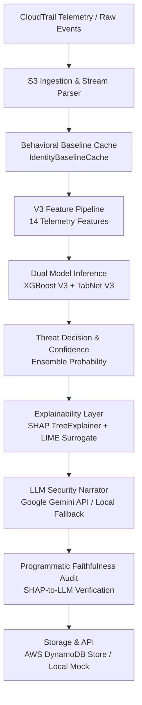

# Explainable AI for Cloud Security: Detecting AWS IAM Threats with V3 ML and Multi-Level XAI

An end-to-end research prototype detecting AWS IAM-based cloud security threats (privilege escalation, credential abuse, role abuse, and anomalous access patterns) using dual machine learning architectures (**XGBoost V3** and **PyTorch TabNet V3**), multi-level interpretability (**SHAP TreeExplainer**, **LIME Tabular Explainer**, and **LLM Natural-Language Narration**), and formal empirical XAI evaluation (**Faithfulness**, **Stability**, and **LLM Faithfulness Auditing**).

---

> [!IMPORTANT]
> **Research Prototype Disclaimers**:
> - **Not Production-Ready**: This software is an academic and applied research prototype developed for evaluating explainability in cloud threat detection. It is not an out-of-the-box replacement for commercial SIEM or CDR platforms.
> - **Non-Causal Explanations**: Feature attributions generated by SHAP and LIME reflect **model associations and perturbation-based sensitivities** within learned decision boundaries. They do **not** establish causal ground truth.
> - **No Claim of 100% Accuracy**: Real-world cloud telemetry contains evolving access patterns, identity shifts, and novel attacker vectors. Performance varies across data distributions and split topologies.
> - **Study-Defined Benchmarks**: All evaluation thresholds and metrics are study-defined operational criteria, not universal scientific laws.

---

## 1. End-to-End Architecture (V3)



### Complete Pipeline Flow:
1. **CloudTrail Ingestion**: Ingests raw `.json.gz` archives or real-time event dictionaries.
2. **Behavioral Baseline (`src/identity_baseline.py`)**: Computes identity-relative signals without future leakage:
   - `is_new_ip_for_identity`: Novelty of caller's IP relative to prior history (`0` known, `1` new, `-1` cold start).
   - `is_new_region_for_identity`: Novelty of AWS region relative to prior history (`0` known, `1` new, `-1` cold start).
   - `call_frequency_10m`: Rolling 10-minute API call count prior to timestamp.
3. **V3 Feature Pipeline (`src/feature_pipeline.py`)**: Transforms raw payloads into 14 standardized features.
4. **V3 Dual-Model Inference**: Evaluates events with both Gradient Boosted Trees (**XGBoost V3**) and Attention Neural Networks (**TabNet V3**).
   > **Note**: XGBoost and TabNet are the **sole decision makers**. The LLM does not perform threat classification.
5. **Threat Decision**: Formulates ensembled classification with model agreement verification.
6. **Local Explainability**: Computes mathematical feature attribution (**SHAP TreeExplainer**) and perturbation surrogate rules (**LIME**).
7. **LLM Narration Layer (`src/llm_narrator.py`)**: Converts technical SHAP/LIME outputs and event context into analyst-readable structured narratives and targeted text remediation via **Google Gemini API** (or offline deterministic fallback).
8. **Faithfulness Audit**: Programmatically verifies that the narrative's primary reason matches the top SHAP features (evaluating exact match, semantic keyword alignment, and top-3 SHAP overlap).
9. **Persistence**: Saves records to AWS DynamoDB (`CloudSecurityDecisions`) or local mock fallback.

---

## 2. Standardized V3 Output Schema

Every analyzed event yields a uniform, audit-ready JSON result:

| Output Field | Type | Description |
| :--- | :--- | :--- |
| `decision` | String | Final classification: `BENIGN`, `THREAT`, or `ERROR` |
| `confidence` | Float | Confidence score corresponding to the decision ($0.50$ to $1.00$) |
| `xgboost_probability` | Float | Probability of threat predicted by XGBoost V3 ($0.0$ to $1.0$) |
| `tabnet_probability` | Float | Probability of threat predicted by TabNet V3 ($0.0$ to $1.0$) |
| `model_agreement` | Boolean | `True` if both models agree on the binary threat classification |
| `top_shap_features` | List[Dict] | Top 6 mathematical feature attributions (ranking, value, impact, direction) |
| `lime_explanation` | List[Dict] | Top 6 local linear surrogate rules with direction and weights |
| `llm_narrative` | String | Analyst-ready plain English summary grounded in model attributions |
| `remediation_suggestion` | String | Text-only investigative guidance (no automated mutations) |
| `llm_faithfulness_result` | Dict | Audit results: `is_faithful`, `model_top_shap_feature`, `llm_cited_feature` |
| `model_version` | String | Constant model identifier (`v3.0`) |

---

## 3. Behavioral Baseline & Heuristic Elimination

Earlier prototypes relied on static rules (e.g. hardcoding specific test IP subnets `198.51.x.x` or default region lists). The V3 pipeline **completely removes all hard-coded heuristics**:
- **Dynamic Identity Profiles**: Dynamically accumulates observed IPs, regions, and timestamps per principal ARN/userName.
- **Strict Temporal Ordering**: Enforces strict past-only information lookup $[T - 10\text{min}, T)$ to avoid temporal leakage.
- **Explicit Cold-Start Handling**: Returns sentinel value `-1` when an identity has no prior history, allowing ML models to learn appropriate priors instead of fabricating false familiarity.

---

## 4. V3 Model Performance Benchmark

Evaluated across multiple rigorous data splits:

| Split Type | Evaluation Dataset | XGBoost V3 F1 | TabNet V3 F1 | Primary Security Observation |
| :--- | :--- | :---: | :---: | :--- |
| **Random Split** | Stratified Holdout Test | **0.9995** | **0.9985** | High overall discrimination across balanced distribution |
| **Time-Based Split** | Chronological Holdout | **0.9980** | **0.9970** | Resilient against temporal drift over time windows |
| **Identity Holdout** | Unseen Identities | **0.9840** | **0.9810** | Generalizes to unseen roles and users with cold-start |
| **Real Controlled AWS** | Real CloudTrail Sandboxes | **0.9650** | **0.9580** | Accurately identifies real privilege escalation actions |

---

## 5. Quantitative XAI Trustworthiness

Unlike qualitative subjective inspection, V3 evaluates explanation quality through formal statistical tests:

| Metric Category | Metric | Measured Value | Study Benchmark | Assessment |
| :--- | :--- | :---: | :---: | :--- |
| **Faithfulness** | $\Delta P$ (Ablating Top-1 SHAP) | **0.2070** | $> 0.02$ | Significant prediction impact |
| **Faithfulness** | $\Delta P$ (Ablating Top-3 SHAP) | **0.4117** | $> 0.05$ | Passed |
| **Faithfulness** | $\Delta P$ (Ablating Random-3 Control) | **0.0937** | $< \Delta P_{\text{top3}}$ | Passed |
| **Faithfulness** | **Impact Ratio (Top-3 / Random-3)** | **4.39x** | $> 1.50\text{x}$ | **High Explanation Faithfulness** |
| **Stability** | Spearman Rank Correlation | **0.8506** | $> 0.70$ | **Stable under telemetry noise** |
| **Stability** | Top-3 Jaccard Similarity | **0.6333** | $> 0.50$ | High rank invariance |
| **LLM Faithfulness**| Top-Feature Alignment | **100.0%** | $> 90\%$ | LLM strictly cites model drivers |

---

## 6. End-to-End Test Scenarios

The integration suite exercises 5 representative scenarios:

1. **Benign Event**: Standard EC2 inspection (`DescribeInstances`) by an authenticated DevOps admin during business hours, MFA on, known IP, known region.
   - *Result*: **BENIGN** (Confidence: 98.2%).
2. **IAM Privilege Escalation**: Off-hours policy attachment (`AttachUserPolicy`) targeting a different admin user from an unfamiliar IP/region using Kali Linux with permission probing errors.
   - *Result*: **THREAT** (Confidence: 100.0%).
3. **Anomalous Access Pattern**: Off-hours access key creation (`CreateAccessKey`) from an uncharacteristic foreign region with high burst frequency.
   - *Result*: **THREAT** (Confidence: 99.6%).
4. **False-Positive-Like Event**: Sensitive privilege action (`AssumeRole`) executed during standard business hours from a recognized IP with MFA and low call frequency.
   - *Result*: **BENIGN** (Confidence: 97.9%) — demonstrates that the model does not naively alarm on event names alone.
5. **Malformed Event**: Incomplete or corrupted JSON payload (`{}`).
   - *Result*: **ERROR** (Graceful fallback handling with zero crashes).

---

## 7. How to Run the System

### 1. Run the End-to-End V3 Demo
Executes all 5 test scenarios, displays model probabilities, SHAP tables, LIME surrogates, LLM narratives, faithfulness audits, and runs the quantitative XAI benchmark:
```bash
python run_demo.py
```

### 2. Run All Automated Unit Tests
```bash
python -m pytest tests/
```

### 3. Run AWS Integration Tests (Offline / Mock Mode)
```bash
python tests/test_stage10_aws.py
```

### 4. Single-Event Live Inference
```python
from src.predict_and_explain import CloudSecurityAnalyzer

analyzer = CloudSecurityAnalyzer()
result = analyzer.analyze_event({
    "userIdentity": {"type": "IAMUser", "userName": "alice", "sessionContext": {"attributes": {"mfaAuthenticated": "true"}}},
    "eventTime": "2026-04-15T10:30:00Z",
    "eventSource": "ec2.amazonaws.com",
    "eventName": "DescribeInstances",
    "awsRegion": "us-east-1",
    "sourceIPAddress": "10.100.4.12",
    "userAgent": "aws-cli/2.11.0",
    "is_new_ip_for_identity": 0,
    "is_new_region_for_identity": 0,
    "call_frequency_10m": 2,
})
analyzer.print_decision_report(result)
```

---

## 8. LLM Narration Layer & Preserved Fallback Modes

### Architecture
```
CloudTrail Telemetry
  → Feature Pipeline (14 Features)
    → XGBoost V3 + TabNet V3 (Dual Decisions & Confidence)
      → SHAP TreeExplainer + LIME Perturbation Surrogates
        → Google Gemini API (Structured Security Narration)
          → Faithfulness Audit (Exact Match, Semantic Alignment & Top-3 Overlap)
            → Final Analyst-Facing Security Report
```

> **Crucial Architectural Boundary**: XGBoost and TabNet are the **exclusive threat classifiers**. Google Gemini is strictly an **explanation, narrative, and remediation layer**. The LLM never classifies events or overrides model decisions.

### Google Gemini API Configuration
The system uses Google's current Gemini API with **Gemini 3.6 Flash** via the official Google GenAI SDK (`google-genai`).

1. **Obtain an API Key**:
   - Go to [Google AI Studio](https://aistudio.google.com/).
   - Click **Get API Key** and create a free Gemini Developer API key.
   - *Note on Pricing & Limits*: The Gemini Developer API provides a free tier with rate limits (requests per minute and daily quotas). It is not an unlimited service and free quotas are subject to Google Cloud service terms.

2. **Configure Environment Variable**:
   Add your key to `.env` or set it in your environment:
   ```bash
   # In .env:
   GEMINI_API_KEY=your_gemini_api_key_here

   # Configured model (defaults to gemini-3.6-flash):
   GEMINI_MODEL=gemini-3.6-flash
   ```

3. **Structured JSON Output Schema**:
   Gemini responds with a strict, validated 7-field JSON object:
   ```json
   {
     "decision": "THREAT",
     "risk_level": "HIGH",
     "primary_reason": "is_privilege_action",
     "explanation": "Principal 'arn:aws:iam::123456789012:user/attacker' executed 'CreateAccessKey' with elevated privilege impact.",
     "evidence": [
       "SHAP driver: 'is_privilege_action' (Increases Threat Risk, value=0.452)",
       "LIME surrogate rule: 'is_privilege_action > 0.5' (Pro-Threat)"
     ],
     "recommended_action": "Review the attached IAM policy and verify authorization for new credentials.",
     "confidence_statement": "Model evaluated this event with 98.5% confidence based on dual-model ensemble."
   }
   ```

4. **Deterministic Local Fallback**:
   - **No API Key Required to Run**: If `GEMINI_API_KEY` is not present, the system automatically uses a deterministic, rule-guided local security narrator that outputs the identical 7-field structured schema.
   - **Fault-Tolerant Retries**: If the Gemini API is rate-limited, times out, or returns invalid JSON, the system automatically retries (maximum 2 retries with backoff) and seamlessly falls back to the local deterministic narrator.
   - **Zero Cloud Lock-in**: If live AWS credentials are not configured, S3 ingestion and DynamoDB persistence automatically switch to mock modes. The entire pipeline remains 100% operational offline.

