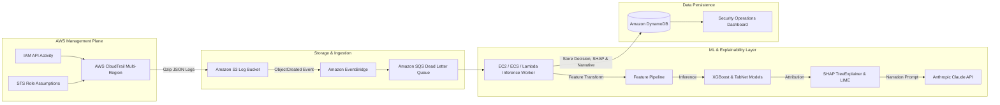

# AWS Production Architecture Blueprint: Explainable AI for Cloud Security

This document details the production integration architecture connecting real AWS infrastructure to the machine learning, explainability (SHAP/LIME), and LLM narration pipeline.

---

## 1. End-to-End Pipeline Architecture



---

## 2. Ingestion & Storage Architecture

1. **AWS CloudTrail Configuration**:
   - Multi-region trail enabled across all active regions.
   - Global service events enabled (essential to capture IAM actions, which are global to `us-east-1`).
   - Log file validation enabled (`EnableLogFileValidation: true`) to ensure cryptographic integrity.
   - S3 delivery path: `s3://<org-security-logs>/AWSLogs/<account-id>/CloudTrail/<region>/YYYY/MM/DD/`.

2. **Event Notification & Queueing**:
   - S3 Bucket notifications configured to publish `s3:ObjectCreated:*` events to an Amazon EventBridge bus.
   - Amazon EventBridge routes events to an Amazon SQS FIFO queue to buffer telemetry spikes and prevent rate-limiting during large CI/CD bursts.

---

## 3. Worker Execution & Microservice Blueprint

1. **Hosting Environment**:
   - Containerized deployment on **Amazon ECS (AWS Fargate)** or an **EC2 c6i.xlarge instance** (compute-optimized for tree-based SHAP calculations).
2. **Real-Time Latency Trade-Offs**:
   - **XGBoost Inference**: ~1.2 milliseconds per event.
   - **SHAP TreeExplainer**: ~2.5 milliseconds per event (highly optimized C++ extension).
   - **LIME Tabular Explainer**: ~85 milliseconds per event (requires sampling 5,000 local linear perturbations).
   - **Claude API Call**: ~700-1200 milliseconds.
   - **Optimization Rule**: Run XGBoost + SHAP for 100% of events; trigger LIME cross-checks and LLM narration only for events where `threat_probability >= 0.50` or high-uncertainty events (`0.40 <= threat_probability <= 0.60`).

---

## 4. DynamoDB Table Schema (`CloudSecurityDecisions`)

### Primary Keys:
- **Partition Key (`PK`)**: `decision_id` (String, UUIDv4)
- **Sort Key (`SK`)**: `timestamp` (String, ISO-8601 UTC)

### Global Secondary Indexes (GSI):
1. **`GSI_Decision`**:
   - Partition Key: `decision` ("THREAT" | "BENIGN")
   - Sort Key: `confidence` (Number)
   - *Use case*: Enables fast queries for SOC analysts filtering by unreviewed high-confidence threats.
2. **`GSI_Principal`**:
   - Partition Key: `principal_arn` (String)
   - Sort Key: `timestamp` (String)
   - *Use case*: Forensics investigation querying historical activity of a compromised identity.

### Attributes:
- `event_name` (String)
- `event_source` (String)
- `aws_region` (String)
- `source_ip` (String)
- `model_probabilities` (Map: `xgboost_threat_prob`, `tabnet_threat_prob`)
- `shap_top_features` (List of Maps: `feature`, `value`, `shap_value`, `impact`)
- `lime_rules` (List of Maps: `rule`, `weight`)
- `llm_narrative` (String)
- `suggested_action` (String)
- `llm_faithfulness_verified` (Boolean)
- `raw_cloudtrail_record` (Map)

---

## 5. Security & Least Privilege IAM Policy

Worker instances running the inference service require minimal IAM permissions:

```json
{
  "Version": "2012-10-17",
  "Statement": [
    {
      "Sid": "S3LogBucketReadAccess",
      "Effect": "Allow",
      "Action": [
        "s3:GetObject",
        "s3:ListBucket"
      ],
      "Resource": [
        "arn:aws:s3:::org-cloudtrail-logs",
        "arn:aws:s3:::org-cloudtrail-logs/*"
      ]
    },
    {
      "Sid": "DynamoDBDecisionWriteAccess",
      "Effect": "Allow",
      "Action": [
        "dynamodb:PutItem",
        "dynamodb:GetItem",
        "dynamodb:Query"
      ],
      "Resource": "arn:aws:dynamodb:*:*:table/CloudSecurityDecisions"
    },
    {
      "Sid": "KMSDecryptLogs",
      "Effect": "Allow",
      "Action": "kms:Decrypt",
      "Resource": "arn:aws:kms:*:*:key/cloudtrail-log-key-id"
    }
  ]
}
```
